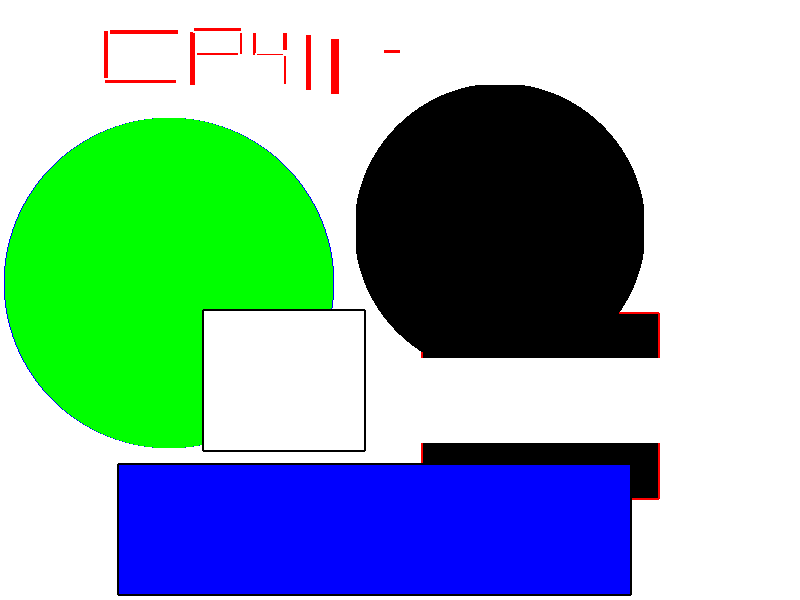

# A2 Report

Author: Nahor Yirgaalem (sign your name here)

Date: September 24, 2021   (insert the date)

Check [readme.txt](readme.txt) for lab work statement and self-evaluation. 

## Q1 Graphics pipeline (short answer)
	
### Q1.1 Primitives

Primitives are geometric elements such as lines, triangles, polygons, verticies, etc. These graphic objects are used to create complex images

### Q1.2 Coordinate systems & transformations

There are a couple coordinate systems. Modeling Coordiante System (MCS), World Coordinate System (WCS), Viewer Coordiante System (VCS), Normalized Device Coordiante System (NDCS) and Device Coordinate System (DCS)
There transformations are Modeling, MCS to WCS. Viewing, WCS to VCS, Projection VCS to viewer's plane, NCDS) and Display, NDCS to DCS.

### Q1.3 Scan conversion

Scan conversion (algorithms) are used to take primtives and convert them into pixles as the last part of the graphics pipeline.

## Q2 OpenGL and Glut (lab practice)
	
### Q2.1 OpenGL primitives
 
Complete? (Yes/No) Yes

If Yes, insert a screen shot image to show the completion.

{width=90%} images/opengl_prim.png

If No,  Add a short description to describe the issues encountered.

### Q2.2 Interactive graphics
 
Complete? (Yes/No) Yes

If Yes, insert a screen shot image to show the completion.

{width=90%} images/menu.png, GL_LINE_STRIP.png, keyexample.png

If No,  Add a short description to describe the issues encountered.

### Q2.3 Bitmap file I/O
 
Complete? (Yes/No) Yes

If Yes, insert a screen shot image to show the completion.

{width=90%} images/output.png

If No,  Add a short description to describe the issues encountered.

## Q3 SimpleDraw (programming)
	
### Q3.1 Display window and menu
 

Complete? (Yes/No) Yes

If Yes, insert a screen shot image to show the completion.

[image caption](images/demo.png){width=90%} images/displayMenu.png

If No, add a short description to describe the issues encountered.

### Q3.2 Data structures
 

Complete? (Yes/No) 

If Yes, insert a screen shot image to show the completion.

[image caption](images/demo.png){width=90%}

If No, add a short description to describe the issues encountered.

### Q3.3 Draw rectangles
 

Complete? (Yes/No) 

If Yes, insert a screen shot image to show the completion.

[image caption](images/demo.png){width=90%} images/rectangle.png

If No, add a short description to describe the issues encountered.

### Q3.4 Draw circles
 

Complete? (Yes/No) 

If Yes, insert a screen shot image to show the completion.

[image caption](images/demo.png){width=90%} images/circle.png

If No, add a short description to describe the issues encountered.

### Q3.5 Edit features
 

Complete? (Yes/No) 

If Yes, insert a screen shot image to show the completion.

[image caption](images/demo.png){width=90%} images/edit.png

If No, add a short description to describe the issues encountered.

### Q3.6 Save/Open SVG files

Complete? (Yes/No).   If Yes, [output.bmp](images/output.svg).

### Q3.7 Export to bitmap

Complete? (Yes/No).   If Yes, .

### Q3.8 Circle&Square artwork

Complete? (Yes/No).   If Yes, [C&S artwork in SVG](images/c&s.svg), .

**References**

1. CP411 a2
2. Add your references if you used. 
